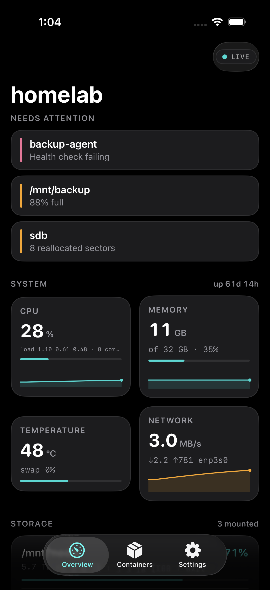
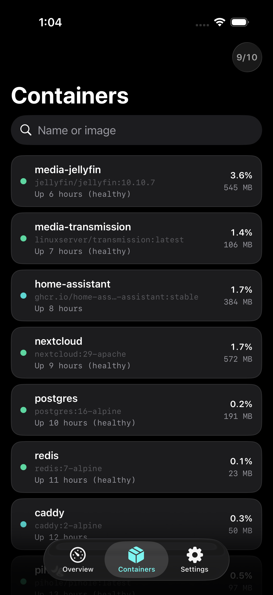

<div align="center">

# Vitals

**Monitor your homelab from your phone, without your server working for it.**

Containers, CPU, memory, disks and S.M.A.R.T. health, live on your iPhone.
The agent samples nothing until you open the app, and stops the moment you close it.

[](LICENSE)


</div>

---

<div align="center">

&nbsp;

</div>

---

## The idea

Most monitoring tools want to run forever. Netdata, Prometheus, Glances in
server mode: they sample on a timer and write a time-series database whether or
not anybody is watching. That is the right design for infrastructure somebody is
paid to keep alive.

A homelab is not that. You check on it when you think about it, maybe twice a
week. The rest of the time those samples are being taken, written and rotated
for nobody, and if your bulk storage is spinning rust you are waking the platters
around the clock to record that nothing happened.

Vitals inverts it. **Opening the app is the switch.**

```
no viewers   →  collector asleep   →  0% CPU, nothing sampled, nothing written
first viewer →  collector wakes    →  samples every 2s, streams over SSE
last viewer  →  collector stops    →  back to 0%
```

Measured on an i5-4590 running 13 containers:

| State | CPU | Threads | Resident |
|---|---|---|---|
| Nobody watching | **0.00%** | 1 | 23 MB |
| One viewer | 0.59% | 3 | 23 MB |
| Viewer left | 0.09% (teardown) | 1 | 23 MB |

It covers the case people forget, too. On iOS the stream follows `scenePhase`,
so an app sitting in your pocket is not a viewer. In a browser the same job is
done by `visibilitychange`, so a dashboard left in a background tab costs
nothing. If you want the process gone entirely between visits, there is a
systemd socket-activated mode where **no agent runs at all** until you connect.

## What you get

- **Containers** with health-check state, live CPU and memory per container,
  read straight from the Docker socket
- **CPU** with load average, **memory** measured against `MemAvailable` rather
  than free, and **temperature** from the warmest core
- **Every real filesystem**, NAS mounts included, with capacity bars
- **S.M.A.R.T. disk health**: reallocated sectors, pending sectors, power-on
  hours, drive temperature. Capacity tells you when a disk is full; SMART is
  what tells you a disk is dying
- **Alerts** that stay silent until something genuinely needs you: a failing
  health check, a container stuck restarting, a disk crossing a threshold, a
  drive growing bad sectors

## Try it in 30 seconds

No pip, no virtualenv, no container image. The agent is one Python file using
only the standard library, because a monitoring tool you cannot install on a
sick machine is not much use.

```bash
git clone https://github.com/M-Nabeegh/vitals.git
cd vitals/agent
python3 vitals.py --demo
```

Open `http://localhost:8321` and you get a fully populated fake homelab, no
server required. Drop `--demo` to see your own machine.

## Install for real

```bash
sudo mkdir -p /opt/vitals && sudo cp agent/* /opt/vitals/
sudo cp deploy/vitals.service /etc/systemd/system/vitals@.service
sudo systemctl enable --now vitals@$USER
```

Requires Python 3.9+ and Linux. The account running it needs to be in the
`docker` group, the same permission `docker ps` needs.

### Nothing running between visits

systemd holds the port, and no Python process exists until the first connection
arrives. The agent exits again after 90 idle seconds.

```bash
sudo cp deploy/vitals-idle.service /etc/systemd/system/vitals-idle@.service
sudo cp deploy/vitals-idle.socket  /etc/systemd/system/vitals-idle.socket
sudo systemctl enable --now vitals-idle.socket
```

### Disk health

`smartctl` needs root, so the agent shells out through `sudo -n`. Grant exactly
that and nothing more:

```bash
sed 's/USERNAME/your-user/' deploy/vitals-smartctl.sudoers | \
  sudo tee /etc/sudoers.d/vitals-smartctl > /dev/null
sudo chmod 0440 /etc/sudoers.d/vitals-smartctl
```

The rule allows `smartctl -H -A` on disk devices only. Neither flag can write to
a disk, change settings, or start a self-test. Skip it and everything else still
works; the disk cards just say SMART is unavailable.

## The iPhone app

`ios/` is a native SwiftUI client. Open `ios/Vitals.xcodeproj`, set your own
signing team under **Signing & Capabilities**, change the bundle identifier to
something unique, and run. iOS 17+.

On first launch, put your agent's address into Settings, for example
`http://homelab.local:8321` or a Tailscale name. Add a token if you set one.

## The web dashboard

The agent serves its own dashboard at `/`, so any browser works with nothing
installed. Same design, same demand-driven behaviour, and it adds to your home
screen as a standalone app.

<div align="center">


</div>

## Options

| Flag | Default | Does |
|---|---|---|
| `--port` | `8321` | Port to listen on |
| `--host` | `0.0.0.0` | Interface to bind |
| `--token` | none | Require `?token=…` or a bearer header |
| `--demo` | off | Serve an invented machine, no real readings |
| `--systemd-socket` | off | Serve on a socket systemd passed in |
| `--idle-exit N` | `0` | Exit after N seconds with no viewers |

Query parameters: `?theme=light|dark` forces a theme for wall displays and
kiosks, `?still=1` renders a single frame without opening the stream.

## Security

Do not put this on the public internet. It exposes container names, images and
your filesystem layout. Reach it over **Tailscale**, **WireGuard**, or a reverse
proxy with real authentication, and set `--token` as a second layer.

The agent is read-only: it cannot start, stop or change anything on your server.
`/healthz` is deliberately unauthenticated so uptime checks work, and returns
only whether the agent is up and how many viewers it has.

## How it works

```
agent/vitals.py       the agent: readers, collector, HTTP, SSE
agent/dashboard.html  the web UI: no build step, no framework, no CDN
ios/                  native SwiftUI client
deploy/               systemd units and the sudoers rule
```

The collector is reference counted. `subscribe()` starts the sampling thread if
it is not already running, and `unsubscribe()` sets a stop event when the count
reaches zero. Everything else follows from that one decision.

Readings come from `/proc/stat`, `/proc/meminfo`, `/proc/net/dev` and
`os.statvfs`, keeping deltas between samples so rates are real rather than
cumulative. Containers come from the Docker socket over `AF_UNIX` using
`http.client`, which is why there is no SDK dependency. Cheap readings refresh
every 2 seconds; disks and SMART every 60, because those touch hardware.

Nothing is persisted anywhere. History exists only as the last 60 samples held
by whatever is viewing, and it dies with the view. **If you need long-term
retention or alerting that reaches you while you are asleep, this is the wrong
tool and Prometheus with Alertmanager is the right one.** Vitals is for looking.

## Contributing

Issues and pull requests are welcome. Useful directions:

- Other init systems, or a container image for people who prefer one
- ZFS and Btrfs pool health, which matters more than raw capacity on those
- GPU readings for people running transcoding or inference
- An Android client

Keep the agent dependency-free. That constraint is the point, not an oversight.

## Licence

MIT. See [LICENSE](LICENSE).
