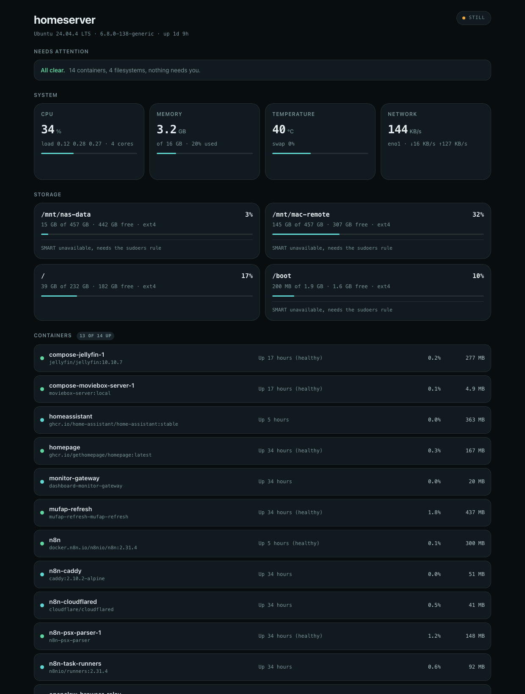
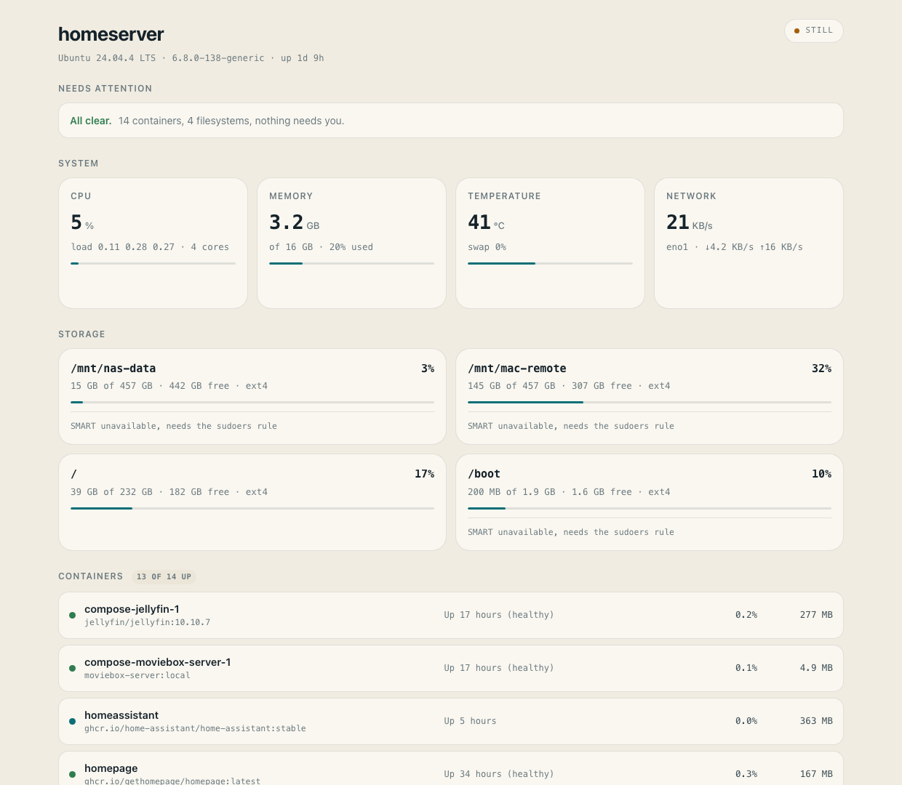
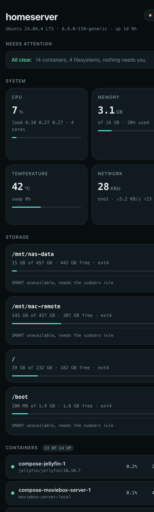

<div align="center">

# Vitals

**A home server dashboard that only works when you are looking at it.**

Nothing is sampled, stored, or written to disk until a browser opens the page.
Close the tab and the collector stops dead.

Zero dependencies · One Python file · No database

</div>

---

<div align="center">

</div>

---

## Why

Every monitoring tool I tried wanted to run forever. Netdata, Prometheus,
Glances in server mode: they sample on a timer, write a time-series database,
and keep doing it whether or not anybody is watching. On a home server with
spinning disks that means waking those platters around the clock to record that
nothing happened.

I look at my server's dashboard maybe twice a week. Paying for it continuously
made no sense.

So Vitals inverts the model. **The open page is the switch.**

```
no viewers   →  collector asleep   →  0% CPU, nothing sampled, nothing written
first viewer →  collector wakes    →  samples every 2s, streams over SSE
last viewer  →  collector stops    →  back to 0%
```

Measured on the machine in the screenshot, an i5-4590 running 13 containers:

| State | CPU | Threads | Resident |
|---|---|---|---|
| Nobody watching | **0.00%** | 1 | 23 MB |
| One viewer | 0.59% | 3 | 23 MB |
| Viewer closed the tab | 0.09% (teardown) | 1 | 23 MB |

It even handles the case people forget: a **hidden tab is not watching**. The
page listens for `visibilitychange` and drops the stream when you switch away,
so a dashboard parked in a background tab costs the server nothing.

## What it shows

- **Containers** with health-check state, per-container CPU and memory, pulled
  straight from the Docker socket
- **CPU** with load average and per-core count, **memory** against
  `MemAvailable` rather than free, **temperature** from the warmest core
- **Every real filesystem**, including NAS mounts, with capacity bars
- **S.M.A.R.T. disk health**: reallocated sectors, pending sectors, power-on
  hours, drive temperature. Capacity tells you when a disk is full; SMART tells
  you when it is dying
- **Alerts** that stay quiet until something genuinely needs you: a failing
  health check, a container stuck restarting, a disk crossing a threshold, a
  drive reporting bad sectors

<div align="center">


</div>

## Install

No pip, no virtualenv, no container. A monitoring tool you cannot install on a
sick machine is not much use, so it uses the standard library only.

```bash
git clone https://github.com/M-Nabeegh/vitals.git
cd vitals/agent
python3 vitals.py --port 8321
```

Open `http://your-server:8321`. That is the whole thing.

Requires Python 3.9+ and Linux. The user running it needs to be in the `docker`
group to read container stats, which is the same permission `docker ps` needs.

### Run it properly

```bash
sudo mkdir -p /opt/vitals && sudo cp agent/* /opt/vitals/
sudo cp deploy/vitals.service /etc/systemd/system/vitals@.service
sudo systemctl enable --now vitals@$USER
```

### Or do not run it at all until asked

The stricter option. systemd holds the port and **no Python process exists**
until the first connection arrives. The agent exits again after 90 idle
seconds, so between visits the machine runs nothing whatsoever.

```bash
sudo cp deploy/vitals-idle.service /etc/systemd/system/vitals-idle@.service
sudo cp deploy/vitals-idle.socket  /etc/systemd/system/vitals-idle.socket
sudo systemctl enable --now vitals-idle.socket
```

### Disk health

`smartctl` needs root, so the agent shells out through `sudo -n`. Grant it
exactly that and nothing else:

```bash
sed 's/USERNAME/your-user/' deploy/vitals-smartctl.sudoers | \
  sudo tee /etc/sudoers.d/vitals-smartctl > /dev/null
sudo chmod 0440 /etc/sudoers.d/vitals-smartctl
```

The rule permits `smartctl -H -A` on disk devices only. Neither flag can write
to a disk, change settings, or start a self-test. Skip this and the dashboard
still works, it just says SMART is unavailable.

## Options

| Flag | Default | Does |
|---|---|---|
| `--port` | `8321` | Port to listen on |
| `--host` | `0.0.0.0` | Interface to bind |
| `--token` | none | Require `?token=…` or a bearer header |
| `--systemd-socket` | off | Serve on a socket systemd passed in |
| `--idle-exit N` | `0` | Exit after N seconds with no viewers |

Query parameters: `?theme=light|dark` forces a theme for kiosks and wall
displays, `?still=1` renders one frame without opening the stream.

## Exposing it

Do not put this on the public internet. It reads container names, images and
filesystem layout. Reach it over **Tailscale**, a **WireGuard** tunnel, or a
reverse proxy with real authentication, and set `--token` as a second layer.

`/healthz` is deliberately unauthenticated so uptime checks work, and it returns
only whether the agent is up and how many viewers it has.

## How it works

```
agent/vitals.py       the whole agent: readers, collector, HTTP, SSE
agent/dashboard.html  the whole UI: no build step, no framework, no CDN
deploy/               systemd units and the sudoers rule
```

The collector is reference counted. `subscribe()` starts the sampling thread if
it is not already running; `unsubscribe()` sets a stop event when the count
reaches zero. Everything else follows from that.

Readings come from `/proc/stat`, `/proc/meminfo`, `/proc/net/dev` and
`os.statvfs`, with deltas kept between samples so rates are real rather than
cumulative. Containers come from the Docker socket over `AF_UNIX` using
`http.client`, which is why there is no SDK dependency. Cheap readings refresh
every 2 seconds; disks and SMART every 60, because those touch hardware.

Nothing is persisted. History exists only as the last 60 samples held in the
browser tab, and it dies with the tab. If you want long-term retention, this is
the wrong tool and Prometheus is the right one.

## Licence

MIT. See [LICENSE](LICENSE).
